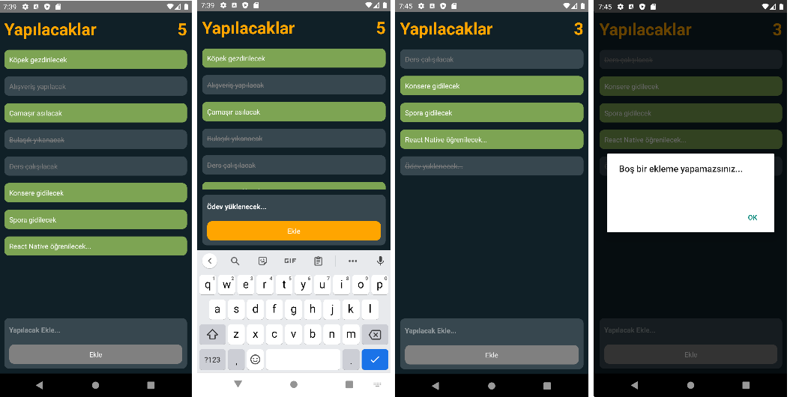

## ReactNativeToDoApp
To-do list app with React Native.

## Patika.dev Account
[Yunus Şükrü Gülten](https://app.patika.dev/yunussukrugulten)

## Project Picture


## Installation
```bash
git clone https://github.com/yunussukrugulten/ReactNativeToDoApp.git
```

## Usage
```linux
cd ReactNativeToDoApp
code .
```

## License
[MIT](https://choosealicense.com/licenses/mit/)
